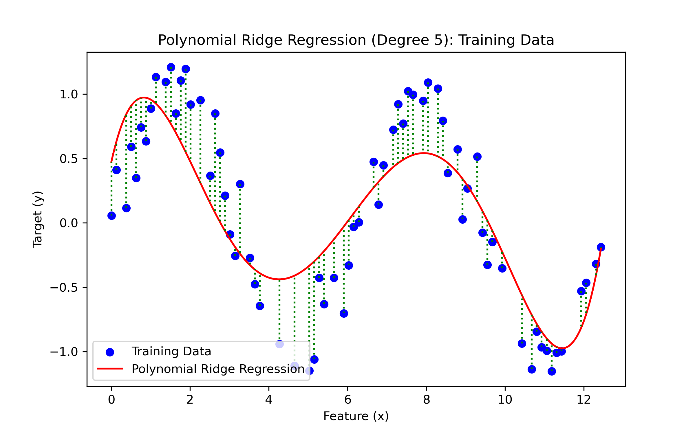
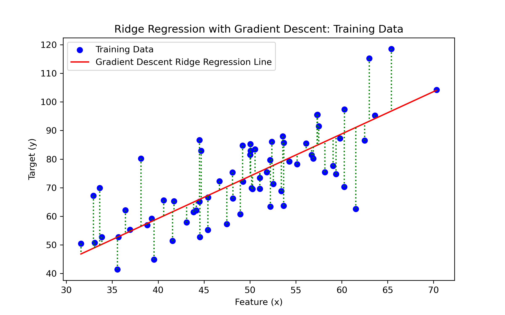
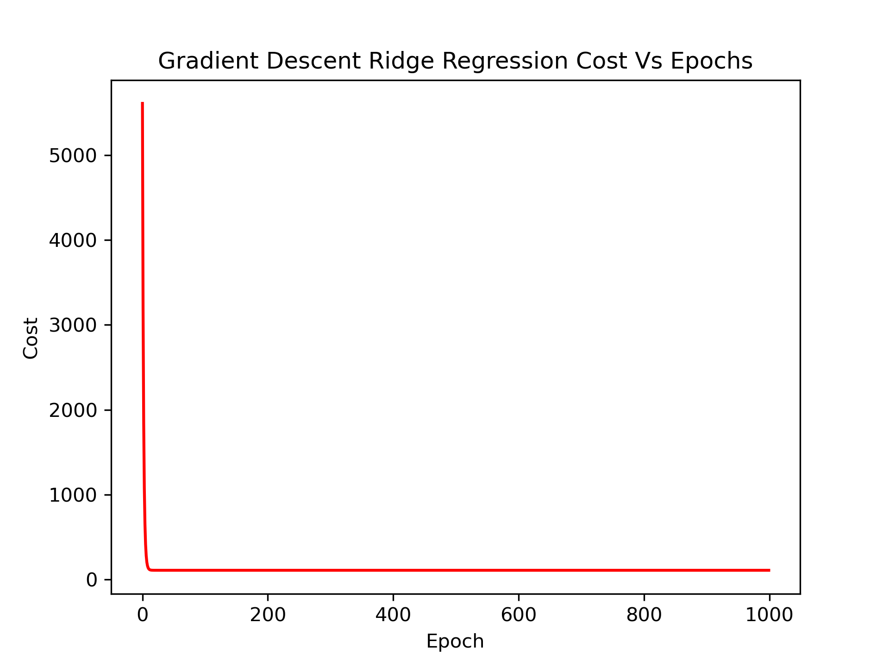
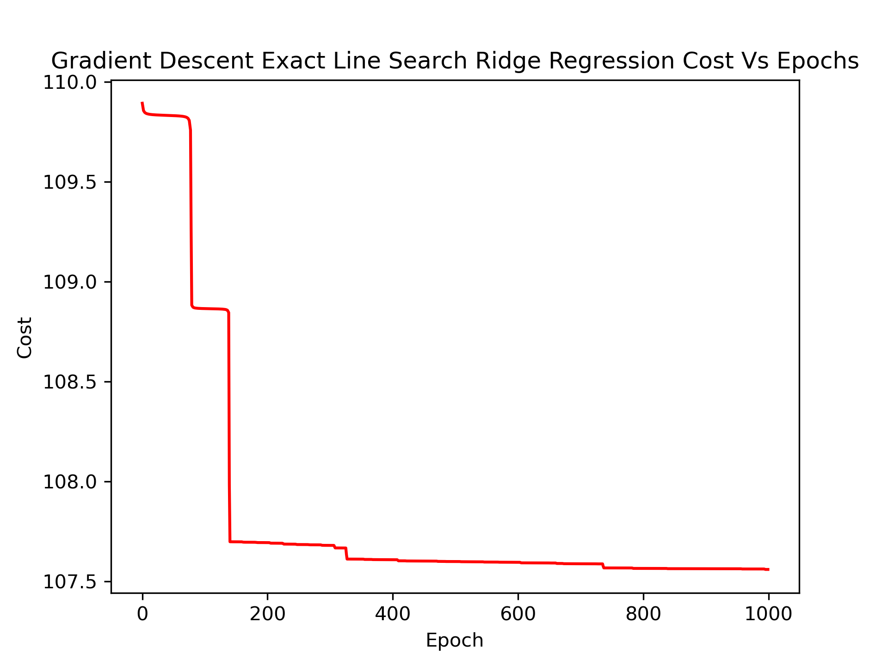

# Machine learning: Ridge regression

## Overview
This project focuses on implementing and comparing different approaches to Ridge Regression, a type of regularized linear regression that includes a regularization parameter to prevent overfitting. The examined methods include the analytical Closed Form solution, the non-linear fitting of Polynomial Regression, and iterative optimization with Gradient Descent (GD) and Exact Line Search (ELS).

## Datasets
The project utilizes two sets of data:

Linear data with a single feature for Ridge Regression.
Non-linear data that is transformed into polynomial features for Polynomial Ridge Regression.

The datasets were split into training and testing sets to evaluate the performance of the models.

## Methodology
Four distinct regression models were implemented:

- **Ridge Regression Closed Form:** A traditional approach using a closed-form solution to find the weights that minimize the regularized loss function.

- **Polynomial Ridge Regression Closed Form:** An extension of the Ridge Regression that includes polynomial features, allowing the model to fit non-linear patterns in the data.

- **Ridge Regression with Gradient Descent (GD):** An iterative optimization algorithm used to minimize the cost function by updating the weights gradually based on the gradient.

- **Ridge Regression with Exact Line Search (ELS):** A modification of the GD approach that includes a line search to find the optimal step size for each iteration.

## Result Analysis
The models were evaluated using Root Mean Squared Error (RMSE) and Mean Absolute Error (MAE). The performance metrics along with visualization plots for each model provided insights into their effectiveness.

### Closed Form Ridge Regression
- *Closed Form Ridge Regression shows a stable solution since it directly calculates the optimal weights.*

### Polynomial Ridge Regression
- *A non-linear fit was visualized, demonstrating the model's capacity to capture more complex patterns.*

### Ridge Regression with GD and ELS
- *Gradient Descent's performance depends on the learning rate and number of iterations*
  
- The use of exact line search in gradient descent potentially improved the convergence speed.

- *This plot shows the cost reducing over time as Gradient Descent iteratively updates the weights.*

- *Exact Line Search potentially finds the optimal learning rate dynamically, which can lead to quicker and more stable convergence compared to standard Gradient Descent.*

## Conclusion
The project successfully demonstrates the application of Ridge Regression in different scenarios. The closed-form solution provides a straightforward method for linear data, while polynomial transformation allows for handling non-linear datasets. Gradient Descent and Exact Line Search offer iterative approaches that converge to the solution, with ELS potentially being more efficient.

## Future Work
- Testing on datasets with higher dimensionality.
- Implementing cross-validation for hyperparameter tuning.
- Comparing Ridge Regression with other regularized regression models like Lasso and Elastic Net.
