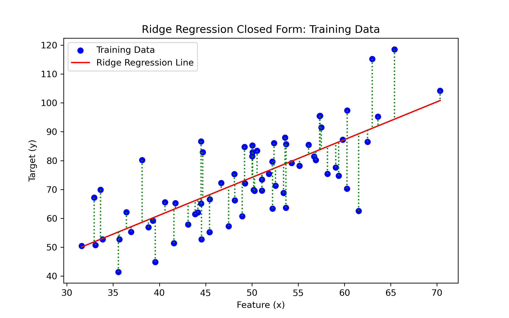

# Machine learning: Ridge regression

This repository contains the implementation of various Ridge Regression techniques including Closed Form, Polynomial Regression, Gradient Descent, and Exact Line Search. The goal is to compare the effectiveness and performance of these techniques on different datasets.

## Regression Techniques Overview

- **Closed Form**: Closed Form solution involves an analytical approach to solve regression weights. It computes the weights using a direct formula, which is computationally intensive. However, provides exact solutions without the need for iterative optimization.
- **Polynomial Regression**: Polynomial Ridge Regression is a form of regression that models the relationship as a polynomial function of the input features. It's useful for capturing the non-linear relationship between the dependent and independent variables.
- **Gradient Descent**: Gradient Descent is an optimization algorithm that iteratively adjusts the parameters to find the minimum cost. It uses a fixed learning rate to update the weights in the opposite direction of the gradient of the cost function.
- **Exact Line Search**: Exact Line Search optimizes the learning rate at each iteration of the Gradient Descent. Unlike the constant step size in traditional GD, Exact Line Search seeks to find the optimal step size that minimizes the cost function most efficiently at each step.

## Visual Analysis

The images below visualize the performance and efficiency of each regression technique:

### Closed Form Ridge Regression

*Closed Form Ridge Regression shows a stable solution since it directly calculates the optimal weights.*

